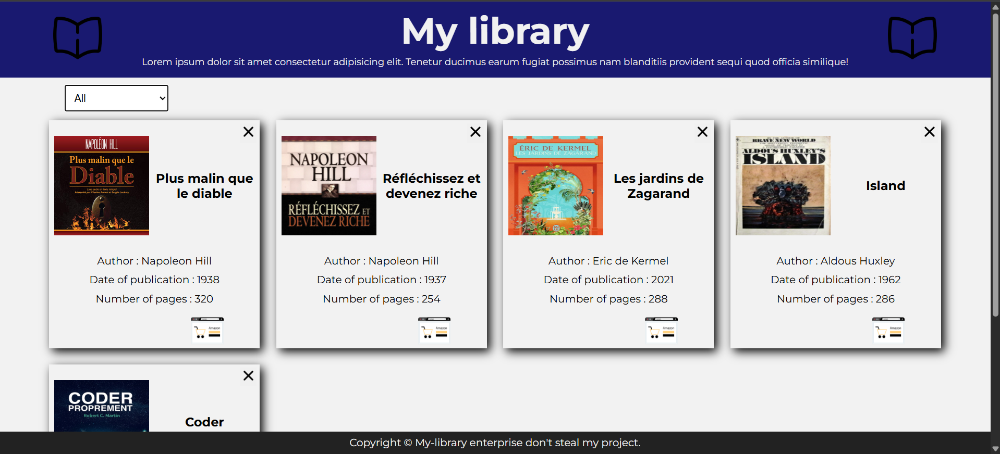

# The Collection 📚

## What is this project?

This project is a personal library where I keep track of the books I've read. You can sort books by author, delete some, and soon, I'll be adding a feature to allow users to add books directly through the [site](https://patoucheh.github.io/the-collection/).

## What it looks like

As with most of my projects on GitHub, the design is kept simple with basic HTML and CSS.
I'm not a web developer, so please judge me on the functionality rather than the appearance! 😁

## How it works

The site is built using HTML, basic CSS, and JavaScript for book management (deleting, sorting, and soon adding books).
Books are stored using localStorage and a JSON file.

### Thank you for reading this README!

#### If you have ideas for improvements or find any bugs, feel free to reach out! 🚀

Don't forget to look in real what it looks like : [Visit the site](https://patoucheh.github.io/the-collection/)
